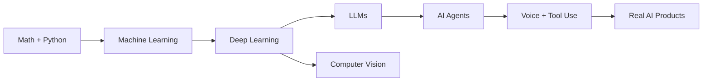

<h1 align="center">Hey, I'm Suhaim Manna</h1>

<h3 align="center">Master's Student in Artificial Intelligence | AI Agents | Voice Tools | Full-stack AI Apps</h3>

<p align="center">
  
</p>

<p align="center">
  
</p>

<p align="center">
  <a href="https://github.com/Suhaimz11">
    
  </a>
  <a href="https://github.com/Suhaimz11?tab=followers">
    
  </a>
  
</p>

---

## AI Cockpit

```txt
> booting profile...

name        Suhaim Manna
role        Master's student in Artificial Intelligence
focus       AI agents, voice interfaces, LLM apps, machine learning
stack       Python, React, JavaScript, Node.js, TensorFlow, PyTorch, SQL
status      learning deeply, building publicly, improving fast
```

## Mission Board

<table>
  <tr>
    <td align="center" width="25%">
      <h3>AI Agents</h3>
      <p>Tool-using assistants, autonomous workflows, and smarter automation.</p>
    </td>
    <td align="center" width="25%">
      <h3>Voice AI</h3>
      <p>Voice-powered agents that feel natural, responsive, and useful.</p>
    </td>
    <td align="center" width="25%">
      <h3>ML / DL</h3>
      <p>Models, training, evaluation, data, and deep learning foundations.</p>
    </td>
    <td align="center" width="25%">
      <h3>AI Apps</h3>
      <p>React + Python projects that turn experiments into products.</p>
    </td>
  </tr>
</table>

## Tech Stack

<p align="center">
  
</p>

<p align="center">
  
  
  
  
  
  
</p>

## Featured Builds

<table>
  <tr>
    <td width="50%">
      <h3 align="center">voice-agent</h3>
      <p align="center">
        
      </p>
      <p align="center">
        A voice-based AI agent focused on interactive, intelligent conversations.
      </p>
      <p align="center">
        <a href="https://github.com/Suhaimz11/voice-agent">
          
        </a>
      </p>
    </td>
    <td width="50%">
      <h3 align="center">AI-AGENT</h3>
      <p align="center">
        
      </p>
      <p align="center">
        An AI agent project for experimenting with workflows, assistants, and automation.
      </p>
      <p align="center">
        <a href="https://github.com/Suhaimz11/AI-AGENT">
          
        </a>
      </p>
    </td>
  </tr>
</table>

## Learning Path



## Contribution Snake

<p align="center">
  <picture>
    <source media="(prefers-color-scheme: dark)" srcset="https://raw.githubusercontent.com/Suhaimz11/Suhaimz11/output/github-contribution-grid-snake-dark.svg" />
    <source media="(prefers-color-scheme: light)" srcset="https://raw.githubusercontent.com/Suhaimz11/Suhaimz11/output/github-contribution-grid-snake.svg" />
    
  </picture>
</p>

## Connect

<p align="center">
  <a href="https://www.linkedin.com/in/suhaim-manna/">
    
  </a>
  <a href="https://x.com/Suhaimz11">
    
  </a>
  <a href="mailto:suhaimmanna99@gmail.com">
    
  </a>
</p>

<p align="center">
  
</p>
