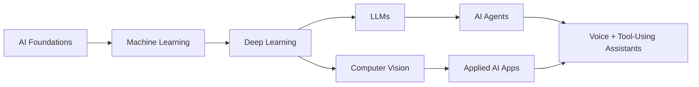

<p align="center">
  
</p>

<p align="center">
  
</p>

<p align="center">
  <a href="https://github.com/Suhaimz11">
    
  </a>
  <a href="https://github.com/Suhaimz11?tab=followers">
    
  </a>
  
  
</p>

---

## System Profile

```yaml
name: Suhaim Manna
handle: Suhaimz11
role: Master's Student in Artificial Intelligence
current_mode: learning, building, experimenting
interests:
  - AI agents
  - voice interfaces
  - machine learning
  - deep learning
  - LLM applications
  - computer vision
  - data science
  - MLOps
mission: build AI projects that feel useful, practical, and alive
```

## What I Am Building Toward

<table>
  <tr>
    <td width="25%" align="center">
      
      <br /><br />
      Assistants that can understand context, use tools, and complete workflows.
    </td>
    <td width="25%" align="center">
      
      <br /><br />
      Natural voice experiences that make AI feel easier to use.
    </td>
    <td width="25%" align="center">
      
      <br /><br />
      ML and DL foundations, from training loops to evaluation.
    </td>
    <td width="25%" align="center">
      
      <br /><br />
      Full-stack AI apps that turn experiments into usable products.
    </td>
  </tr>
</table>

## Tech Stack

<p align="center">
  
</p>

<p align="center">
  
  
  
  
  
  
  
  
</p>

## Featured Builds

<table>
  <tr>
    <td width="50%">
      <h3 align="center">voice-agent</h3>
      <p align="center">
        
      </p>
      <p>
        A voice-based AI agent focused on interactive, intelligent conversation. This is where I experiment with the bridge between speech, reasoning, and usable assistant behavior.
      </p>
      <p align="center">
        <a href="https://github.com/Suhaimz11/voice-agent">
          
        </a>
      </p>
    </td>
    <td width="50%">
      <h3 align="center">AI-AGENT</h3>
      <p align="center">
        
      </p>
      <p>
        An AI agent project for exploring autonomous workflows, assistant behavior, and practical automation patterns with modern AI systems.
      </p>
      <p align="center">
        <a href="https://github.com/Suhaimz11/AI-AGENT">
          
        </a>
      </p>
    </td>
  </tr>
</table>

## Learning Map



## Contribution Snake

<p align="center">
  <picture>
    <source media="(prefers-color-scheme: dark)" srcset="https://raw.githubusercontent.com/Suhaimz11/Suhaimz11/output/github-contribution-grid-snake-dark.svg" />
    <source media="(prefers-color-scheme: light)" srcset="https://raw.githubusercontent.com/Suhaimz11/Suhaimz11/output/github-contribution-grid-snake.svg" />
    
  </picture>
</p>

## Connect

<p align="center">
  <a href="https://www.linkedin.com/in/suhaim-manna/">
    
  </a>
  <a href="https://x.com/Suhaimz11">
    
  </a>
  <a href="mailto:suhaimmanna99@gmail.com">
    
  </a>
</p>

<p align="center">
  
</p>

<p align="center">
  <sub>Learning deeply. Building publicly. Improving one project at a time.</sub>
</p>
